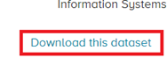
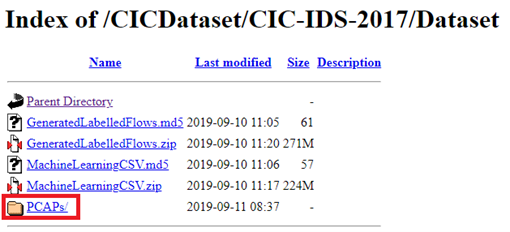
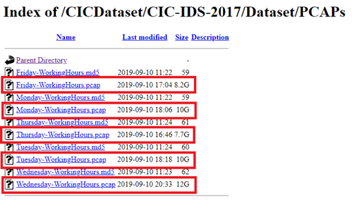
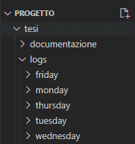
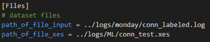
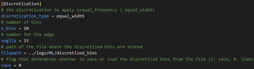
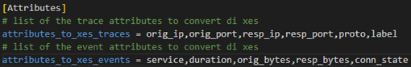
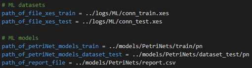

# SINTESI DI UN APPROCCIO BASATO SU PROCESS DISCOVERY PER IL MONITORAGGIO DEL TRAFFICO DI RETE

## Struttura del repository

    .
    ├── documentazione       	                    # contiene tutti i file riguardanti la documentazione del progetto
    ├── pcap_files         		                    # contiene degli esempi di file pcap da far convertire a Zeek
    ├── README_images         		                # contiene le immagini all'interno del README
    ├── scripts                 
    |   ├ ConnectionsAnomalyDetector                # cartella principale del progetto 
    │   │   ├ __main__.py        	                # eseguibile principale del programma
    |   │   ├ ConnectionsModule                     # contiene il modulo per la conversione da file log a file xes
    |   │   │    ├ __init__.py                      # contiene gli import delle classi per il modulo
    |   │   │    ├ CONN_LABEL.py                    # enumeratore delle classi delle connessioni       
    |   │   │    ├ CONN_STATE.py                    # enumeratore dello stato della connessione (possibili valori che conn_state può assumere in event)
    |   │   │    ├ Event.py                         # Gestisce un event di un trace con i suoi attributi, i getter e la discretizzazione
    |   │   │    ├ EventHistory.py                  # Gestisce la conversione dell'attributo history di un event da stringa a valori degli attributi, inoltre contiene i getter e la discretizzazione dei valori continui
    |   │   │    ├ PROTO.py                         # enumeratore dei protocolli della connessione (possibili valori che proto può assumere in trace)
    |   │   │    ├ Trace.py                         # Gestisce un trace come collezione di eventi con i suoi attributi, e i getter e la discretizzazione degli attributi di event
    |   │   │    └ TracesController.py              # Gestisce la conversione da log a trace e da trace a xes
    |   │   ├ DiscretizerModule                     # contiene gli algoritmi di discretizzazione da applicare prima della generazione dei file xes
    |   │   │    ├ __init__.py                      # contiene gli import delle classi per il modulo
    |   │   │    ├ DISCRETIZATION_TYPE.py           # enumeratore dei tipi di discretizzazione (equal_width o equal_height)      
    |   │   │    ├ Discretizer.py                   # classe astratta per effettuare la discretizzazione dei valori degli attributi di Event e EventHistory continui
    |   │   │    ├ Equal_Frequency_Discretizer.py   # Implementa l'algoritmo di discretizzazione equal frequency
    |   │   │    └ Equal_Width_Discretizer.py       # Implementa l'algoritmo di discretizzazione equal width
    |   │   ├ EntryPoint                            # contiene le due classi main per le due parti del progetto (generazione file xes e sperimentazione)
    |   │   │    ├ __init__.py                      # contiene gli import delle classi per il modulo
    |   │   │    ├ MainMachineLearning.py           # Gestisce la sezione di sperimentazione del progetto
    |   │   │    └ MainTraceController.py           # Gestisce la sezione di conversione da file log a file xes
    |   │   └ MachineLearning                       # contiene i moduli per la sperimentazione
    |   │        ├ __init__.py                      # contiene gli import delle classi per il modulo
    |   │        ├ AnomalyDetector.py               # Gestisce la rilevazione di anomalie dei trace
    |   │        ├ PetriNet.py                      # Gestisce la generazione di una PetriNet e dei livelli di fitness di un Trace
    |   │        └ PetriNetCollector.py             # Gestisce una PetriNet per ogni attributo e la generazione del dataset composto dai livelli di fitness dei Trace per l'AnomalyDetector
    |   └ config.ini                               # file di configurazione dei parametri per la sperimentazione e la conversione da log a xes
    ├── apply_labels_to_logs.py                     # effettua l'applicazione delle label alle connessioni nel log secondo le regole del dataset
    ├── LICENSE                                     # licenza per utilizzo della repository di tipo MIT
    ├── requirments.txt		                        # requisiti per funzionamento del codice
    └── README.md

## Manuale utente

## Download e installazione dei software necessari

La sperimentazione richiede come sistema operativo Linux con una distro Debian (in questa sperimentazione è stato utilizzato Ubuntu 22.04 – scaricabile al link: https://www.ubuntu-it.org/download) con i seguenti software con la relativa reperibilità:

- Python 3: tutorial per effettuare il download e installazione disponibile 
al link https://phoenixnap.com/kb/how-to-install-python-3-ubuntu;
-  Zeek (versione attuale github 5.1.1): passaggi per eseguire il download
e installazione dei sotto moduli necessari per l’installazione di Zeek e 
clonare Zeek dalla repository di Github disponibili al link 
https://docs.zeek.org/en/master/install.html.

Successivamente va effettuato il download delle librerie di Python utilizzate, 
tramite i seguenti comandi:
- numpy: `pip install numpy;`
- tqdm: `pip install tqdm;`
- pandas: `pip install pandas;`
- matplotlib: `python -m pip install -U matplotlib;`
- scikit-learn: `pip install -U scikit-learn;`

## Download del Dataset
Il Dataset è disponibile a piè della pagina web https://www.unb.ca/cic/datasets/ids-2017.html, cliccando sul link “`download this dataset`” mostrato in figura, 

si viene reindirizzati su un form da compilare con i propri dati di cui ne viene mostrato un esempio:

Effettuando la sottomissione del form, si viene reindirizzati alla seguente 
pagina, dove si deve cliccare sulla cartella PCAPs/ come mostrato 
nella figura sottostante:

Al click della cartella PCAPs/ si viene reindirizzati alla schermata di selezione dei file pcap da scaricare, per iniziare il download, è necessario selezionare il file che si vuole scaricare tra quelli evidenziati in figura e ne verrà avviato il download

## Generazione di un file xes

Inizialmente è necessario generare un file log dai file pcap scaricati. Zeek, quando viene richiamato da linea di comando, genera i file log nella cartella corrente del terminale. Quindi, per evitare di effettuare troppe modifiche al file config.ini, si consiglia di spostarsi nella cartella principale della tesi, e creare la cartella logs, che è la cartella principale dove memorizzare i log e successivamente, per ogni giornata, creare le cartelle:
- lunedì: `logs/monday`;
- martedì: `logs/tuesday`;
- mercoledì: `logs/wednesday`;
- giovedì: `logs/thursday`;
- venerdì: `logs/friday`.

In modo da ottenere l’albero di cartelle come in figura:

Successivamente ci si deve spostare nelle cartelle delle giornate per le quali si vuole effettuare la sperimentazione, ed eseguire il comando seguente:

`$ /usr/local/zeek/bin/zeek -r *pcapfile*.pcap`

L’esecuzione del comando avvia la generazione di tutti i file log compreso conn.log. Inseguito, è necessario creare il file conn_labeled.log tramite l’esecuzione dello script Python contenuto nel file apply_labels_to_logs.py che, dato in input al file:
- il __nome__ della giornata;
- il percorso del file _conn.log_.

crea il file etichettato nella cartella del file di input. Ad esempio, spostandosi nella cartella `logs/monday` si può creare il file etichettato tramite il comando:

`$ python apply_labels_to_logs.py monday conn.log`

Inseguito, si modifica il file config.ini in base alle proprie cartelle:

Successivamente si impostano i valori di discretizzazione:

Infine, si impostano gli attributi da inserire nei trace ed event del file xes

Alla conclusione della personalizzazione del file _config.ini_, si possono generare i file xes. Per avviare l’applicativo, è necessario spostarsi nella cartella _/tesi/scripts/_ e inserire il seguente comando nel terminale:

`$ python ConnectionsAnomalyDetector/ -dataset`

A questo punto appaiono a schermo delle barre di progresso che indicano la percentuale di completamento della varie fasi per la generazione dello xes. Al termine dell’esecuzione è stato generato il file xes nella posizione indicata nel file _config.ini_.

## Avvio sperimentazione

La sperimentazione necessita di due file xes, il file per la generazione delle PetriNets (`path_of_file_xes_train`), e il secondo per la validazione (`path_of_file_xes_test`). Inoltre, è necessario effettuare l’impostazione del file config.ini per personalizzare i percorsi dei file di input e output:

e determinare quali attributi degli event nello xes devono essere considerati activity:

Al termine dell’impostazione del file config.ini, si può avviare la sperimentazione spostandosi nella cartella “_tesi/scripts/_” tramite il seguente comando:

`$ python ConnectionsAnomalyDetector/ -ml`

Al termine dell’esecuzione del programma viene generato un file report con queste caratteristiche:
- come righe si hanno sono i livelli di soglia utilizzati per determinare se i trace sono anomali o meno;
- le colonne sono le metriche di valutazione dell'Anomaly Detector

Le metriche di valutazione utilizzate per la valutazione dell'Anomaly Detector sono:
-	**TP**: true positive, il numero di esempi normali, che sono stati predetti come normali;
-	**FN**: false negative, il numero di esempi normali, che sono stati predetti come anomali;
-	**FP**: false positive, il numero di esempi anomali, che sono stati predetti come normali;
-	**TN**: true negative, il numero di esempi anomali, che sono stati predetti come anomali;
-	**precision (positive)**: il rapporto tra il numero degli esempi predetti correttamente come normali sul totale degli esempi predetti normali
-	**recall (positive)**: il rapporto tra il numero degli esempi predetti correttamente come normali sul totale degli esempi effettivamente normali
-	**fscore (positive)**: misura che tiene conto della precision (positive) e recall (positive), calcolando la media armonica di precisione e recupero;
-	**precision (negative)**: il rapporto tra il numero degli esempi predetti correttamente come anomali sul totale degli esempi predetti anomali;
-	**recall (negative)**: il rapporto tra il numero degli esempi predetti correttamente come anomali sul totale degli esempi effettivamente anomali;
-	**fscore (negative)**: misura che tiene conto della precision (negative) e recall (negative), calcolando la media armonica di precisione e recupero[;
-	**accuracy**: rapporto tra il numero degli esempi predetti correttamente sul numero degli esempi;
-	**macroF**: media aritmetica dei valori di f-score positivi e negativi;
-	**WeigthedF**: media ponderata dei valori di f-score positivi e negativi, pesati considerando il supporto di ogni classe.
